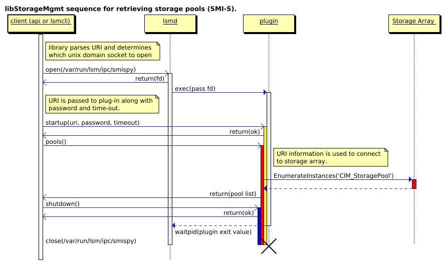

* [1. Setup developer environment][01]
    * [1.1. Grab the code][0101]
    * [1.2. Install build dependencies][0102]
    * [1.3. Compile][0103]
    * [1.4. Run from the code tree][0104]
* [2. Code Workflow][02]
* [3. C Library Code Layout][03]
    * [3.1. Client API -- `libstoragemgmt/libstoragemgmt.h`][0301]
    * [3.2. Plugin API --
      `libstoragemgmt/libstoragemgmt_plug_interface.h`][0302]
* [4. Python Library Code Layout][04]
    * [4.1. Client API and Plugin API -- `_client.py`][0401]
    * [4.2. `_common.py`][0402]
    * [4.3. `_data.py`][0403]
    * [4.4. `_iplugin.py`][0404]
    * [4.5. `_pluginrunner.py`][0405]
    * [4.6. `_transport.py`][0406]
    * [4.7. `version.py`][0407]
* [5. LSM Daemon Code layout.][05]
* [6. Tests][06]
    * [6.1. C Unit Test -- `tester.c`][0601]
    * [6.2. Command Line Tool Test -- `cmdtest.py`][0602]
    * [6.3. Plugin Test(Python API) -- `plugin_test.py`][0603]
* [7. How to contribute.][07]

This document is assuming you already read the [User Guide][1].

## 1. Setup developer environment

### 1.1. Grab the code

```bash
# The rest document is assuming your working folder is $HOME
# which store the git repo as "$HOME/libstoragemgmt" folder.
$ git clone https://github.com/libstorage/libstoragemgmt.git
```

### 1.2. Install build dependencies

#### 1.2.1. RHEL/Centos/Fedora

```bash
# Make sure build dependencies are installed
# For EL6 install python-argparse also
$ sudo yum install tar make gcc gcc-c++ libtool autoconf automake \
       yajl-devel pywbem libxml2-devel  check-devel glib2-devel \
       m2crypto libmicrohttpd-devel json-c-devel \
       openssl-devel perl-Config-IniFiles time PyYAML libconfig-devel \
       chrpath valgrind
```

#### 1.2.2. OpenSuSE

```bash
$ sudo zypper in gcc tar make gcc gcc-c++ libtool autoconf automake \
    libyajl-devel python-pywbem libxml2-devel check-devel \
    glib2-devel python-M2Crypto openssl-devel python-PyYAML \
    libjson-devel procps libmicrohttpd-devel libconfig-devel \
    chrpath valgrind
```

#### 1.2.3. Debian

```bash
$ sudo apt-get install gcc tar make g++ libtool autoconf automake \
    libyajl-dev python-pywbem libxml2-dev check \
    libglib2.0-dev python-m2crypto libssl-dev python-yaml \
    libjson-c-dev procps libmicrohttpd-dev libconfig-dev \
    chrpath valgrind
```

### 1.3. Compile

```bash
# Change into root of source tree
$ cd libstoragemgmt

# Setup autotools
$ ./autogen.sh

# Configure
$ ./configure

# Build it
$ make
```

### 1.4. Run from the code tree

#### 1.4.1. Automatic way -- lsmenv

```bash
# EPEL7 is needed for perl-Config-IniFiles on RHEL/Centos 7
$ sudo yum install perl-Config-IniFiles
# or openSuSE:
# sudo zypper in perl-Config-IniFiles
# or debian:
# sudo apt-get install libconfig-inifiles-perl

# Link 'lsmenv' to $HOME/bin
# Assuming libstoragemgmt is in "$HOME" and $HOME/bin is in $PATH
# Check 'lsmenv -h' for detail usage.
$ ln -s $HOME/libstoragemgmt/tools/lsmenv $HOME/bin/

# Start lsmd daemon from code tree
# You can skip the sudo if you don't intent to run plugin in root mode.
$ sudo lsmenv lsmd

# Invoke lsmcli command
$ lsmenv sim lsmcli list --type pools

# Invoke plugin test
$ lsmenv sim plugin_test
```

#### 1.4.2. Manual way

```bash
# Assuming libstoragemgmt is in "$HOME"

# Create socket folder:
$ mkdir /tmp/lsm/ipc/

# Link lsmcli and plugin into lsm python binding folder
$ ln -sv ../../plugin $HOME/libstoragemgmt/python_binding/lsm/

# Export LSM required environment variables
$ export LSM_UDS_PATH="/tmp/lsm/ipc/"
$ export PYTHONPATH=\
    "$PYTHONPATH:$HOME/libstoragemgmt/python_binding/lsm"
$ export LD_LIBRARY_PATH=\
    "$LD_LIBRARY_PATH:$HOME/libstoragemgmt/c_binding"

# Run lsmd daemon
# You can skip the sudo if you don't intent to run plugin in root mode.
$ sudo $HOME/libstoragemgmt/daemon/lsmd \
    --confdir $HOME/libstoragemgmt/config \
    --plugindir $HOME/libstoragemgmt/plugin \
    -v -d

# Run lsmcli
$ $HOME/libstoragemgmt/tools/lsmcli/lsmcli ls -u sim://

# Invoke plugin test
$ $HOME/libstoragemgmt/test/plugin_test.py
```

## 2. Code Workflow

```text
            User application(for example: lsmcli)
                        ^
                        |
                        |
                        v
     +------------------+-----------------------+
     |                                          |
   Python API           or                    C API
     |                                          |
     +------------------------------------------+
            |                           ^
            | Initial call              |
            v                           |
    Socket of LSM Daemon                |
            |                           |
            | Invoke and setup          |
            | plugin                    |
            |                           v
            +-------------------> Socket of LSM plugin
                                        ^
                                        |
                                        |
                                        | Storage Vendor SDK
                                        |
                                        v
                                 Storage Array/RAID
```

The communication between client and LSM daemon/plugin is based on unix
domain socket (default folder is /var/run/lsm/ipc/) and using JSON-RPC
for protocol.

Example:




## 3. C Library Code Layout

The C library code is located at 'libstoragemgmt/c_binding' folder.
It basically uses C++ codes internally for data converting between
socket JSON to LSM C API.

TODO: Explain which lib we are using for JSON, socket, and etc.


### 3.1. Client API -- `libstoragemgmt/libstoragemgmt.h`

The `libstoragemgmt/libstoragemgmt_plug_interface.h` file
is located at `c_binding/include/libstoragemgmt/libstoragemgmt.h`,
defining client API. It handles communication between client and plugin.
The plugin interface only accept JSON input and only provide JSON
output.  This set of methods are responsible to convert C methods into
JSON format and convert plugin JSON output to C values.

Most of its methods are implemented in `c_binding/lsm_mgmt.cpp`.

### 3.2. Plugin API -- `libstoragemgmt/libstoragemgmt_plug_interface.h`

The `libstoragemgmt/libstoragemgmt_plug_interface.h` file is located
at `c_binding/include/libstoragemgmt/libstoragemgmt_plug_interface.h`,
defining C plugin API. It handles communication between plugin and
client. It convert the output of plugin registered method to JSON
output and send back to client API.

Most of its methods are implemented in `c_binding/lsm_plugin_ipc.cpp`

## 4. Python Library Code Layout

The Python library codes are located at 'libstoragemgmt/python_binding'
folder.

### 4.1. Client API and Plugin API -- `_client.py`

The `_client.py` is located  `python_binding/lsm/_client.py` defining
the client API.

Since plugin is directly communicate with client after initialisation,
this file could also be treated as plugin API definition.

This is the sample code of client API user:

```
#!/usr/bin/python2
import lsm

lsm_cli_obj = lsm.Client("sim://")      # Make connection.

pools = lsm_cli_obj.pools()             # Enumerate Storage Pools.
```

This file is providing the lsm.Client class and its methods.

### 4.2. `_common.py`

This file is providing lsm.ErrorNumber, lsm.LsmError for public client
use.

The Proxy class is for internal use, it make sure all other python
exception is wrapped into LsmError.

The 'ErrorLevel' class is not used anywhere. Might be removed in the
future.

### 4.3. `_data.py`

This file is providing LSM classes defination like lsm.System, lsm.Pool
and etc.

### 4.4. `_iplugin.py`

Provide a wrapper class `INetworkAttachedStorage`,
`IStorageAreaNetwork`, and `INfs` to raise
LsmError.ErrorNumber.NO_SUPPORT when plugin does not implement user
requested methods.

### 4.5. `_pluginrunner.py`

Provide class `PluginRunner` to server in `xxx_lsmplugin`.
Please check `libstoragemgmt/plugin/sim/sim_lsmplugin` for detail.

### 4.6. `_transport.py`

Used by `_client.py` to provide communication between plugin and user
application.

### 4.7. `version.py`

Generated by autoconf tools for `VERSION` constant.

## 5. LSM Daemon Code layout.

The daemon code is located at "libstoragemgmt/daemon" folder.

### 5.1. lsmd -- `lsm_daemon.c`

Code workflow:

1. Scan `--plugindir` argument defined folder excursively for plugins.
   All executable file named with `_lsmplugin` suffix will be consider
   as a lsm plugin.

2. Create a UNIX STREAM socket in `--socketdir` folder for each plugin.
   Example, for `sim_lsmplugin` plugin, and `/tmp/lsm/ipc` as socketdir,
   a UNIX STREAM socket will be created at `/tmp/lsm/ipc/sim`.

3. Once received data on any UNIX socket, invoke the plugin binary with
   the socket filer description number as first argument.

4. The plugin binary will reply API request via UNIX socket.

### 5.2. `lsm_restd`

Still in experimental stage.
Using `microhttpd.h` for http server, `json/json.h` for JSON parsing,
`libxml/uri.h` for URI parsing.

As LSM internally use JSON data for pluing-client communication, this daemon
simply convert JSON request from web service to LSM JSON format.

## 6. Tests

The 'make check' command will run three tests via `runtest.sh`.

### 6.1. C Unit Test -- `tester.c`
Designed to test C API against simc and sim plugin.

### 6.2. Command Line Tool Test -- `cmdtest.py`

Designed to test lsmcli against sim plugin.

### 6.3. Plugin Test(Python API) -- `plugin_test.py`

Designed to test all plugin via Python API.

## 7. How to contribute.

1. Discuss in maillist if it's a new feature or big changes.
2. Work on patches
3. git format patch
4. Make sure your patch meet these requirements:
    * Python PEP8(python-pep8) pass.
    * Python code static check(pylint): no error or fatal.
    * "make distcheck" pass.
    * "make rpm" pass.
    * No regression for plugin_test against changed plugin.
    * Every patch should leave the code tree in a working state
    * WS & spelling corrections in separate patch.
    * Every patch only contain one small change.
    * Patch set only contain one serial change.
    * Test code should be included if changed area is not tested.
5. git send-email to libstoragemgmt-devel maillist.

[1]: user_guide.html
[01]: #1-setup-developer-environment
[0101]: #1-1-grab-the-code
[0102]: #1-2-install-build-dependencies
[010201]: #1-2-1-rhel-centos-fedora
[010202]: #1-2-2-opensuse
[010203]: #1-2-3-debian
[0103]: #1-3-compile
[0104]: #1-4-run-from-the-code-tree
[010401]: #1-4-1-automatic-way-lsmenv
[010402]: #1-4-2-manual-way
[02]: #2-code-workflow
[03]: #3-c-library-code-layout
[0301]: #3-1-client-api-libstoragemgmt-libstoragemgmt-h
[0302]: #3-2-plugin-api-libstoragemgmt-libstoragemgmt_plug_interface-h
[04]: #4-python-library-code-layout
[0401]: #4-1-client-api-and-plugin-api-_client-py
[0402]: #4-2-_common-py
[0403]: #4-3-_data-py
[0404]: #4-4-_iplugin-py
[0405]: #4-5-_pluginrunner-py
[0406]: #4-6-_transport-py
[0407]: #4-7-version-py
[05]: #5-lsm-daemon-code-layout
[0501]: #5-1-lsmd-lsm_daemon-c
[0502]: #5-2-lsm_restd
[06]: #6-tests
[0601]: #6-1-c-unit-test-tester-c
[0602]: #6-2-command-line-tool-test-cmdtest-py
[0603]: #6-3-plugin-test-python-api-plugin_test-py
[07]: #7-how-to-contribute
